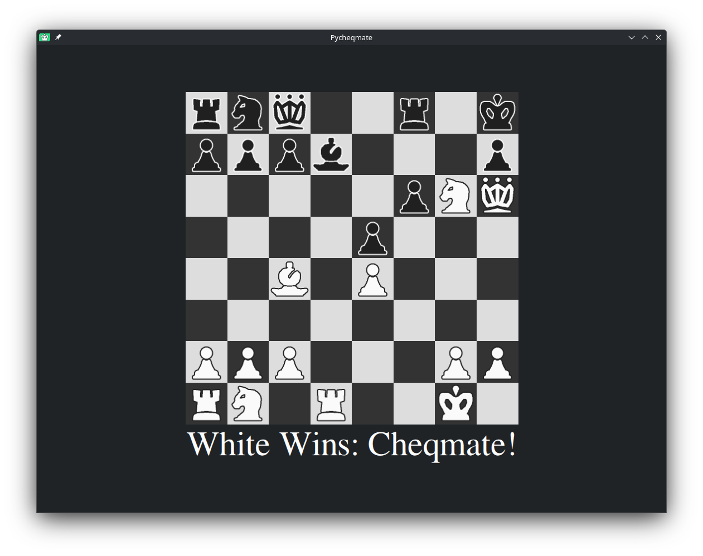

# Pycheqmate

A (yet another...) chess implementation made using Python and Qt6 

## Installation
### if you want to try a stable release of the project:
Go to the [releases tab](https://github.com/anannaranj/pycheqmate/releases) and install the release you wish

## Development:
### if you want to try this from source code:
1. `git clone https://github.com/anannaranj/pycheqmate`
1. `cd pycheqmate`
1. `python -m venv env`

1. On UNIX like systems:  
&nbsp;&nbsp;Fish:  
&nbsp;&nbsp;&nbsp;`source env/bin/activate.fish`  
&nbsp;&nbsp;Others (default):  
&nbsp;&nbsp;&nbsp; `source env/bin/activate`  
&nbsp;On Windows:  
&nbsp;&nbsp;`env\Scripts\activate.bat`
1. `pip install -r requirements.txt --resume-retries 5`
1. `cd src`
1. run `main.py`

## Building from source:
1. do the same steps 1-6 from the development section
1. `python -m nuitka main.py`
